# MacroMind: Nutrition Tracking App

MacroMind simplifies nutrition tracking by enabling users to scan any food item—packed or unpacked—and instantly view its nutritional information tailored to their unique profiles.

## Key Features

- **Instant Scanning:** Scan any food item via image or text input to get nutritional details.
- **Personalization:** Tailors information based on user profiles, including allergies and health conditions.
- **Allergen/Health Alerts:** Provides warnings for potential allergens or foods unsuitable for specific health conditions.
- **Inventory Management:** Track food items you have at home.
- **Meal Suggestions:** Get meal ideas based on your current inventory using AI.
- **Goal Tracking:** Monitor daily/weekly progress towards nutritional goals.
- **(Planned)** Community Features: Share progress and motivate others.
- **(Planned)** Freshness Tracking: Monitor food freshness to reduce waste.

## Technology Stack

- **Frontend:** Expo (React Native)
- **Backend:** Node.js, Express.js
- **Database:** PostgreSQL (with Sequelize ORM)
- **AI:** Google Gemini API (Vision and Text analysis)

## Setup and Running the Project

**Prerequisites:**

- Node.js (LTS version recommended)
- npm or yarn
- Expo Go app (for mobile testing) or Android/iOS simulators
- PostgreSQL database instance
- Google Gemini API Key

**Installation:**

1.  Clone the repository: `git clone <your-repo-url>`
2.  Navigate to the project directory: `cd <repository-folder-name>`
3.  Install root and backend dependencies: `npm run install:all`

**Configuration:**

1.  Create a `.env` file in the **root** directory (for the Expo app). See `.env.example` for required variables (like `EXPO_PUBLIC_API_URL`).
2.  Create a `.env` file in the **`backend/`** directory. See `backend/.env.example` for required variables (like `DATABASE_URL`, `JWT_SECRET`, and `GEMINI_API_KEY`).

**Running the Application:**

1.  **Start the Backend:** Open a terminal, navigate to the `backend` folder (`cd backend`), and run: `npm run dev`
2.  **Start the Frontend:** Open another terminal in the **root** project directory and run: `npx expo start`
3.  Follow the instructions in the Expo terminal to open the app on your device/simulator.

## Screenshots

**Login & Sign Up:**
 
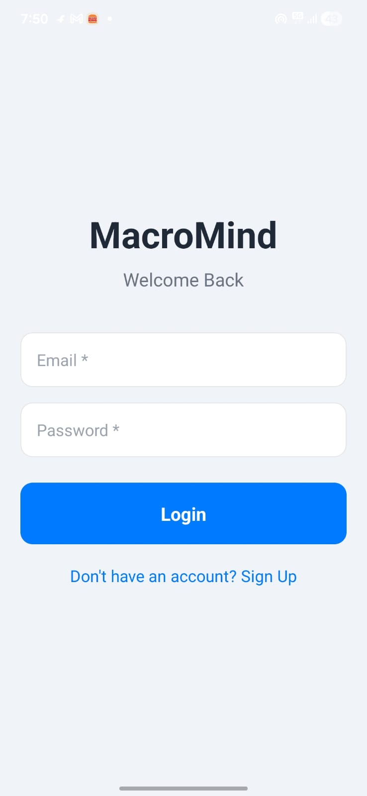
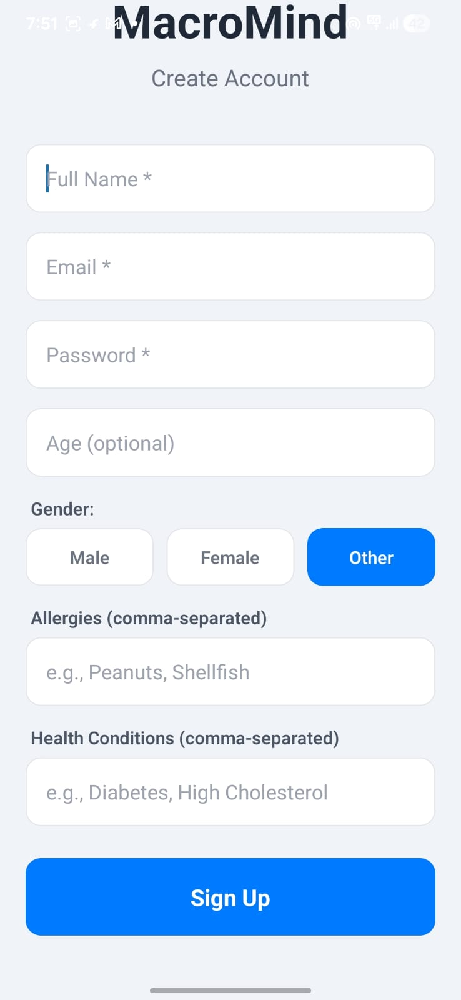

---

**Profile:**
 
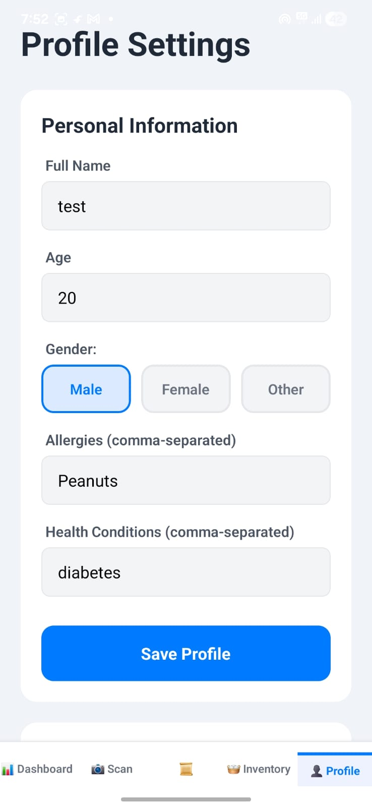
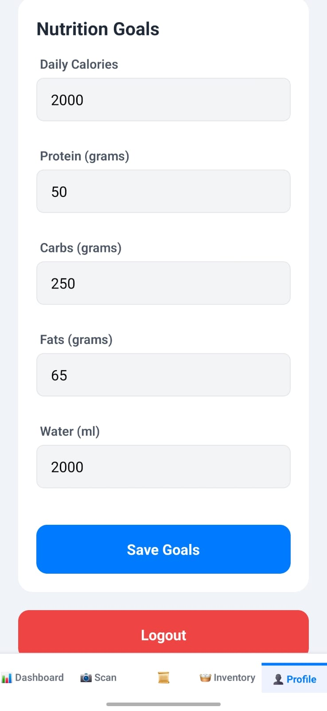

---

**Dashboard:**
 
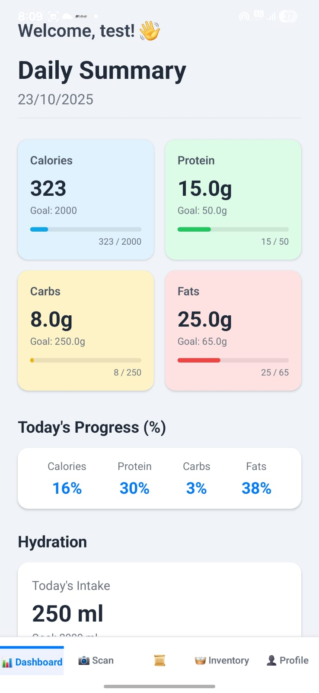
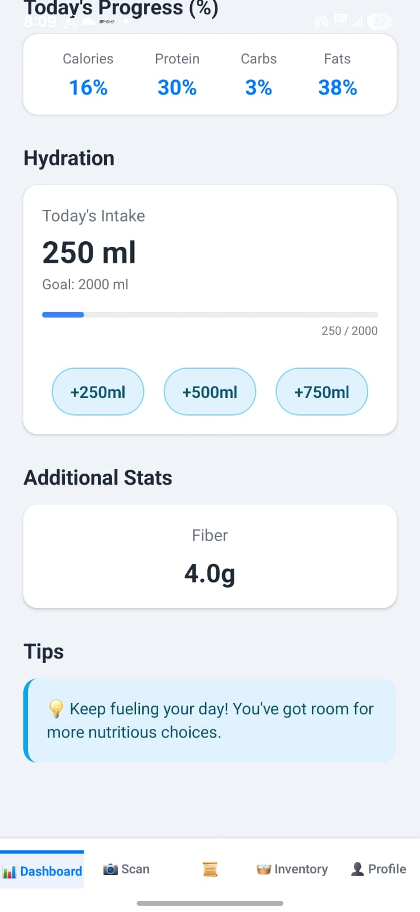

---

**Scanner & Results:**
 
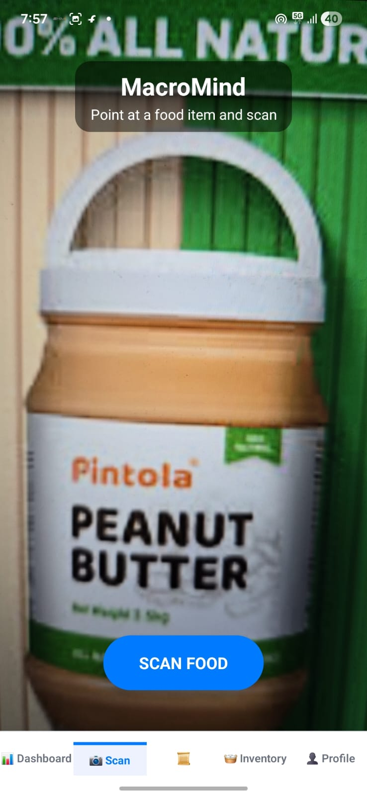
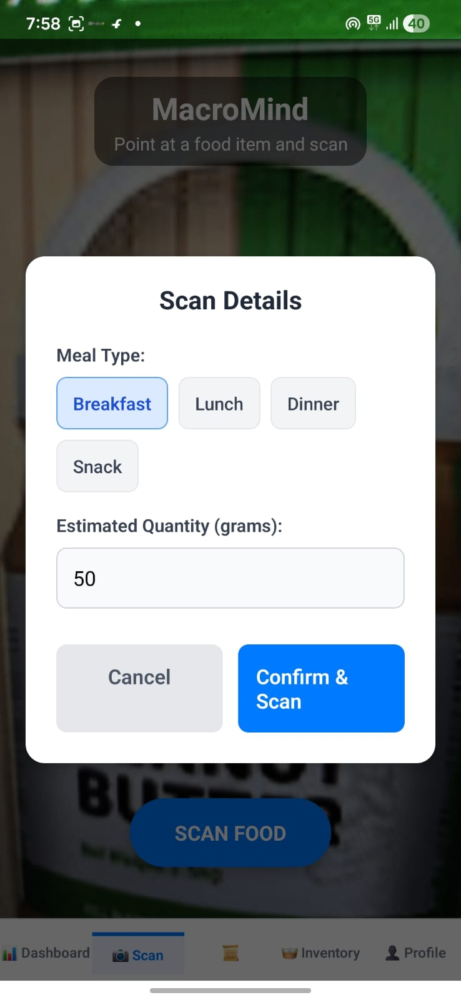
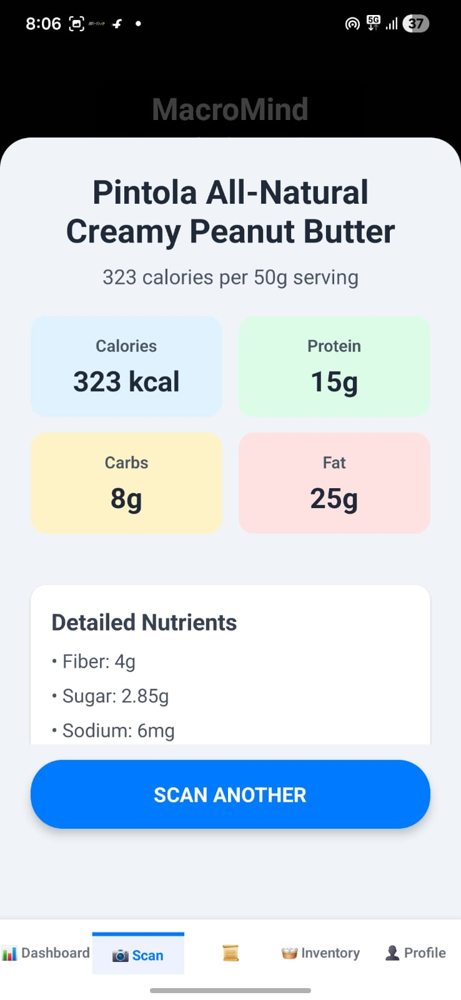
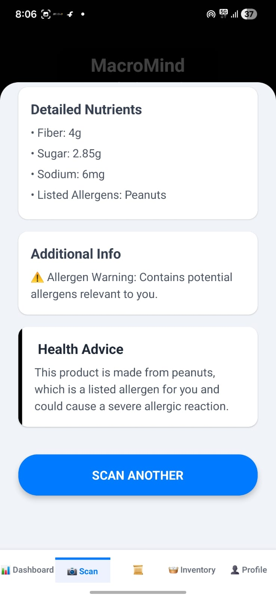

---

**History:**
 
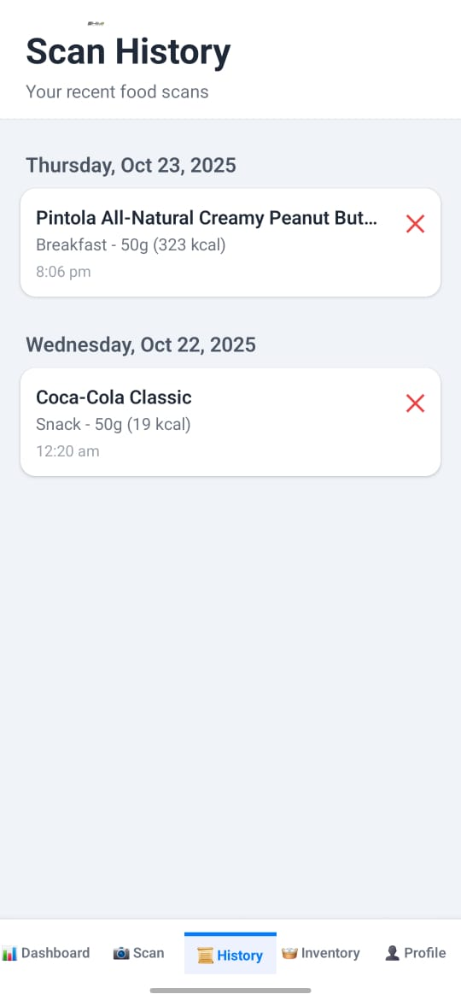
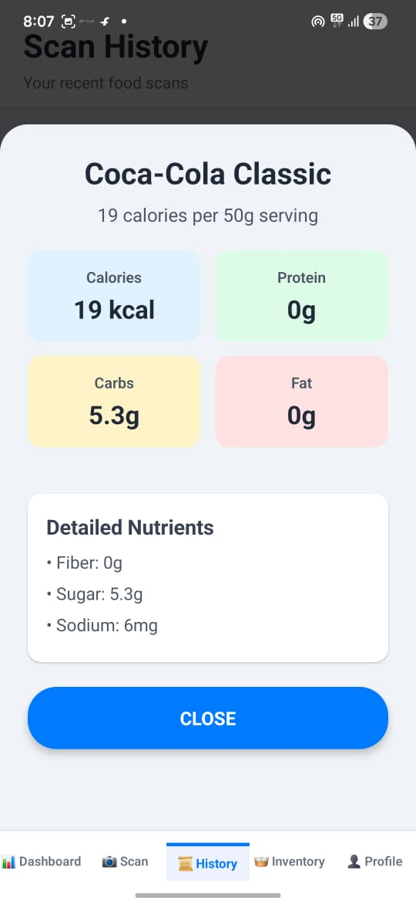

---

**Inventory & Suggestions:**
 
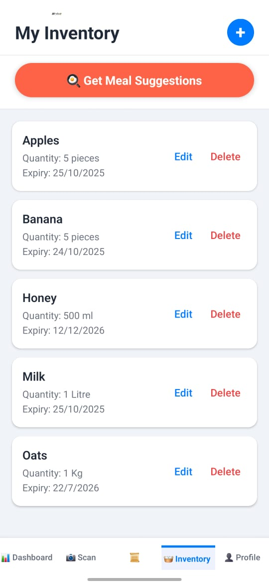
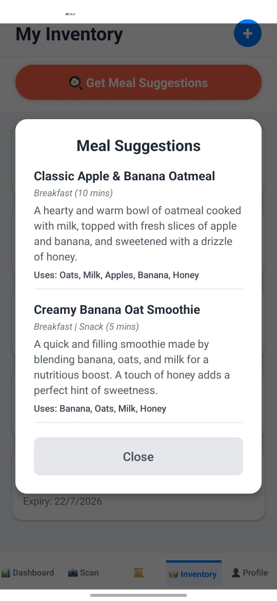
